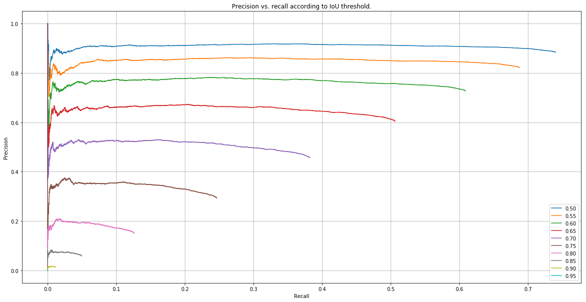

# Face vijnana yolov3
## Face recognition Keras model using yolov3 as a base model and a pretrained model, including face detection and face identification


Using the pretranied [yolov3 Keras model](https://github.com/experiencor/keras-yolo3), we develop one shot learning face recognition model using Keras.
The face recognition model consists of face detection and face identification models, and using uncontrained college students face dataset provided by 
[UCCS](https://vast.uccs.edu/Opensetface/), the face detection and face identification models are trained and evaluated.
In the face detection model, we have developed referring to [YOLOv3: An Incremental Improvement](https://pjreddie.com/media/files/papers/YOLOv3.pdf), and 
in the face identification model, we have developed referring to [FaceNet: A Unified Embedding for Face Recognition and Clustering](https://arxiv.org/abs/1503.03832).

# Tasks
- [x] Develop face vijnana yolov3.
- [x] Train and evaluate face detector with the UCCS dataset.
- [ ] Train and evaluate face identifier using [a GAN style-based face generator](https://github.com/NVlabs/stylegan) with the UCCS dataset.
- [ ] Train, evaluate and optimize face vijnana yolov3 with other datasets.

## Tasks status

[Style based GAN is being developed for virtual face generation](https://github.com/tonandr/keras_unsupervised/tree/master/examples/style_based_gan)

## Test environments
The face recognition model has been developed and tested on Linux(Ubuntu 16.04.6 LTS), Anaconda 4.6.11, Python 3.6.8, 
Tensorflow 1.13.1 (Keras's backend), Keras 2.2.4 and on 8 CPUs, 52 GB memory, 4 x NVIDIA Tesla K80 GPUs.

## Training and testing procedure
### Install [Anaconda](https://docs.anaconda.com/anaconda/install/linux/)

### After installing Anaconda, create the environment

```conda create -n tf1_p36 python=3.6```

### Go to the created environment

```conda activate tf1_p36```

### Install [CUDA Toolkit 10.1](https://developer.nvidia.com/cuda-downloads?target_os=Linux&target_arch=x86_64&target_distro=Ubuntu&target_version=1604&target_type=debnetwork)

### Install [cuDNN v7.6.0 for CUDA 10.1](https://developer.nvidia.com/rdp/cudnn-download) 

### Install tensorflow

```conda install tensorflow==1.13.1```

or

```conda install tensorflow-gpu==1.13.1```


### Download the face recognition git repository

```git clone https://github.com/tonandr/face_vijnana_yolov3.git```


### Install face vijnana yolov3

```cd face_vijnana_yolov3```

```python setup.py sdist bdist_wheel```

```pip install -e ./```

```cd face_vijnana_yolov3\src\space```

### Download yolov3 pretrained model weight

```wget https://pjreddie.com/media/files/yolov3.weights```

### Make the resource directory

In the resource directory, make the training and validation folders, and copy training images & training.csv into the training folder and validation images & validation.csv into the validation folder.

The dataset can be obtained from [UCCS](https://vast.uccs.edu/Opensetface/).

### Configuration json format file (face_vijnana_yolov3.json)

```
{
	"fd_conf": {
		"mode": "train",
		"raw_data_path": "/home/ubuntu/face_vijnana_yolov3/resource/training",
		"test_path": "/home/ubuntu/face_vijnana_yolov3/resource/validation",
		"output_file_path": "solution_fd.csv",
		"multi_gpu": false,
		"num_gpus": 4,
		"yolov3_base_model_load": false,
		"hps": {
			"lr": 0.0001,
			"beta_1": 0.99,
			"beta_2": 0.99,
			"decay": 0.0,
			"epochs": 67,
			"step": 1,
			"batch_size": 40,
			"face_conf_th": 0.5,
			"nms_iou_th": 0.5,
			"num_cands": 60,
			"face_region_ratio_th": 0.8
		},
			
		"nn_arch": {
			"image_size": 416,
			"bb_info_c_size": 6
		},
			
		"model_loading": false
	},
	
	"fi_conf": {
		"mode": "fid_db",
		"raw_data_path": "/home/ubuntu/face_vijnana_yolov3/resource/training",
		"test_path": "/home/ubuntu/face_vijnana_yolov3/resource/validation",
		"output_file_path": "solution_fi.csv",
		"multi_gpu": false,
		"num_gpus": 4,
		"yolov3_base_model_load": false,
		"hps": {
			"lr": 0.000001,
			"beta_1": 0.99,
			"beta_2": 0.99,
			"decay": 0.0,
			"epochs": 35,
			"step": 1,
			"batch_size": 16,
			"sim_th": 0.2
		},
			
		"nn_arch": {
			"image_size": 416,
			"dense1_dim": 64
		},
			
		"model_loading": true
	}
}
```

### First, train the face detection model 

It is assumed that 4 Tesla K80 GPUs are provided. You should set mode to "train". For accelerating computing, you can set multi_gpu to true and the number of gpus.

```python face_detection.py```

You can download [the pretrained face detection Keras model](https://drive.google.com/open?id=1pzGO4YyR46VaMLNeP4_462vWWydAAnYG).
It should be moved into face_vijnana_yolov3/src/space.

### Evaluate the model via generating detection result images, or test the model

Set mode to 'evaluate' or 'test', and you should set model_loading to true.

```python face_detection.py```

### Create subject faces and database 

Mode should be set to "data" in fi_conf.

```python face_identification.py```

You can download [subject faces](https://drive.google.com/open?id=1rq_0Fd7Wqmug6c6wfBxzpys-z8yQRgje) and 
[the relevant meta file](https://drive.google.com/open?id=1zUhU7v4eB7Fdx-QVXng0ksg_77PIiytW). 

The subject face folder should be moved to the resource folder, and the relevant meta file should be moved to 
the src/space folder.

### Train the face identification model 

Set mode to "train". To train the model with previous weights, you should set model_loading to true.

```python face_identification.py```

### Evaluate the model via generating detection result images, or test the model 

Set mode to 'evaluate' or 'test', and you should set model_loading to true.

```python face_identification.py```

# Performance
## Face detection performance
### Calculate mean average precision according to IoU threshold

After getting the face detection solution file of solution_fd.csv, mAP could be calculated as follows.

```python evaluate.py -m cal_map_fd -g validation.csv -s solution_fd.csv```

the result is saved in p_r_curve.h5 as the hdf5 format, so you load it and analyze the performance.

### Current face detection performance


We have evaluated face vijnana yolov3's face detection performance with the UCCS dataset. Yet, the model wasn't trained until saturation, so via training more, the performance can be enhanced.

<table>
<thead>
<tr>
<th>mAP</th>
<th>AP50</th>
<th>AP55</th>
<th>AP60</th>
<th>AP65</th>
<th>AP70</th>
<th>AP75</th>
<th>AP80</th>
<th>AP85</th>
<th>AP90</th>
<th>AP95</th>
</tr>
</thead>
<tbody>
<tr>
<td>23.57</td>
<td>67.21</td>
<td>58.35</td>
<td>46.61</td>
<td>33.04</td>
<td>19.45</td>
<td>8.41</td>
<td>2.32</td>
<td>0.35</td>
<td>0.0172</td>
<td>0.0000635</td>
</tr>
</tbody>
</table>

There are [face detection result images](https://drive.google.com/open?id=1JelgyzOEN1WNXUl1HKIY2eH_yEcaJ7fA).
## Face identification performance
TODO
